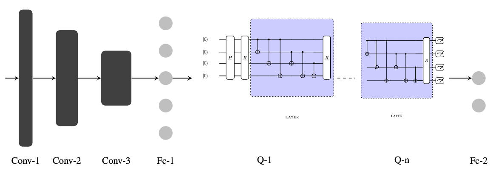
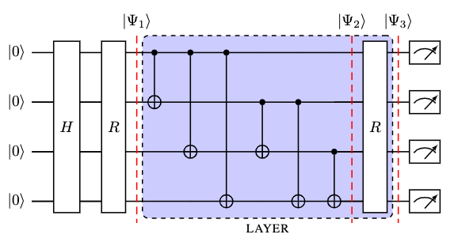
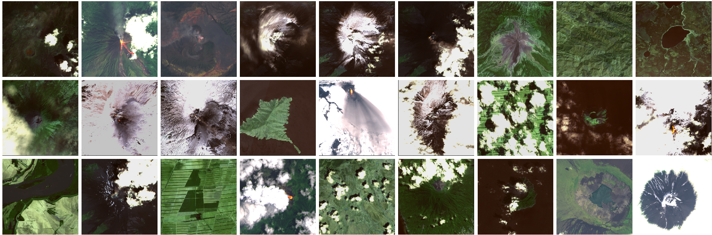

# Hybrid Quantum Convolutional Neural Network Classifier
**Authors: Alessandro Sebastianelli, Maria Pia Del Rosso, Silvia Ullo and Paolo Gamba**

## Method

Our method involves the use of hybrid quantum convolutional neural networks. In other terms, the model is composed of two blocks, the classical convolutional network made by the layers [Conv-1, Conv-2, Conv-3] and a quantum circuit. There are also two fully connected layer [Fc1] and [Fc2] stacked before and after the quantum circuite. They are used mainly to adapt the input and output of the quantum circuit.

The quantum circuit in the figure above is made by repeating fundaments blocks as better shown in the figure below. More importantly the number of qubits can vary while respecting the gates desposition. The firue shows an example with 4 qubits.

 
	

## Dataset
The dataset firstly presented in [1], collects 1726 Sentinel-2 images divided in the classes "eruption" and "non eruption". It has implemented to explore the on-board volcanic eruption detection. An example is reported in the figure below.

[1] Del Rosso, Maria P., Alessandro Sebastianelli, Dario Spiller, Pierre P. Mathieu, and Silvia L. Ullo. 2021. "On-Board Volcanic Eruption Detection through CNNs and Satellite Multispectral Imagery" Remote Sensing 13, no. 17: 3479. https://doi.org/10.3390/rs13173479

Please note that in our experiments we used a K-fold cross validation. In order to do that, we split the dataset in K parts (5 in our case) and saved the splits locally in order to have correpsondance in our experiments.

## Results

Please read the paper to get a full picture of the results, here are only reported some of them.

| Model       | \# parameters | \# quantum | Accuracy |
|-------------|---------------|------------|----------|
| QCNN 2L-4Q  | 40 k          | 8          | 0.86     |
| QCNN 2L-6Q  | 40 k          | 12         | 0.88     |
| QCNN 2L-8Q  | 40 k          | 16         | 0.93     |
| QCNN 3L-4Q  | 40 k          | 12         | 0.87     |
| QCNN 3L-6Q  | 40 k          | 18         | 0.92     |
| QCNN 3L-8Q  | 40 k          | 24         | 0.95     |
| Big Model   | 2 M           | -          | 0.85     |
| Small Model | 200 k         | -          | 0.83     |
| LeNet-5     | 60 k          | -          | 0.68     |
| AlexNet     | 50 M          | -          | 0.83     |

## Installation
1. Clone this repository 

   ` git clone https://github.com/alessandrosebastianelli/hybrid-quantum-classifier.git`

2. Create a new virtual environment with conda or virtualenv
3. Activate the virtual environment
4. Install dependencies listed in requirements.txt

   `pip install -r requirements.txt` or `conda install --file requirements.txt`

5. Run main.py* 
    
    `python main.py`

[*] Please note that there is a configuration file that must be adapted before running the main.

## Configuration file
Before running the main script you must check the [config file](config.py). This file is organized in thre sections:

1. Dataset settings: here you have to set the root path of the training and validation set respectively
2. QCNN settings: here you can modify the quantum cicuit structure by acting on "NUM_QUBITS" and "NUM_LAYERS. You can also modify the path where the model will be saved after the training
3. CNN settings: as the previous case you can act on some parameters of the two CNNs released within the hybrid QCNNs as well as the path where the models will be saved after the training

## Cite our works
To cite this repository please use the 'Cite this repository' option on the right panel. 
Please also cite the corresponding paper:

    @article{frery2015successfully,
      title={Hybrid Quantum Convolutional Neural Network for Remote Sensing Image Classification},
      author={Sebastianelli, Alessandro and Del Rosso, Maria Pia and Ullo, Silvia Liberata and Gamba, Paolo},
      journal={IEEE Geoscience and Remote Sensing Letters},
      volume={},
      number={},
      pages={},
      year={2022},
      publisher={IEEE}
    }

You may find also interesting our other works on Quantum ML4EO

    @ARTICLE{9647979,
      author={Sebastianelli, Alessandro and Zaidenberg, Daniela Alessandra and Spiller, Dario and Saux, Bertrand Le and Ullo, Silvia Liberata},
      journal={IEEE Journal of Selected Topics in Applied Earth Observations and Remote Sensing}, 
      title={On Circuit-Based Hybrid Quantum Neural Networks for Remote Sensing Imagery Classification}, 
      year={2022},
      volume={15},
      number={},
      pages={565-580},
      doi={10.1109/JSTARS.2021.3134785}
    }
~

    @INPROCEEDINGS{9553133,
      author={Zaidenberg, Daniela A. and Sebastianelli, Alessandro and Spiller, Dario and Le Saux, Bertrand and Ullo, Silvia Liberata},
      booktitle={2021 IEEE International Geoscience and Remote Sensing Symposium IGARSS}, 
      title={Advantages and Bottlenecks of Quantum Machine Learning for Remote Sensing}, 
      year={2021},
      volume={},
      number={},
      pages={5680-5683},
      doi={10.1109/IGARSS47720.2021.9553133}
    }